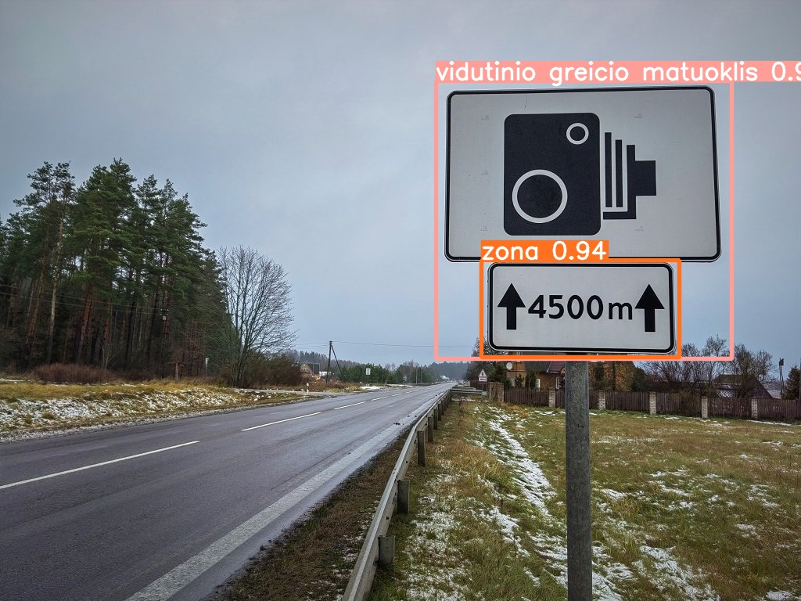

# Kodas recognitionui ir TensorFlow Lite modelis
- Recognition.py – failas su python kodu, kuriame bandau pasitelkęs opencv-python(cv2) biblioteką išsikviesti kamerą ir siųsti frame'us (kadrus) į modulį.
    - Iš modulio nepavyksta gauti jokių detectionų. Neįsivaizduoju kodėl.
- best-fp16_2.tfilte – TensorFlow Lite modulis, kuris buvo konvertuotas iš YOLOv5s modulio.
    - Testuotas Google Colab'e, paduodant jam vieną foto. 
    
    - Detection'as veikia puikiai, tą patį reikėtų gauti Recognition.py faile realiu laiku, naudojant kamerą.
    - Google Colab'e paleidau detect.py tai į jį ir reikėtų žiūrėti: [detect.py](https://github.com/ultralytics/yolov5/blob/master/detect.py)
